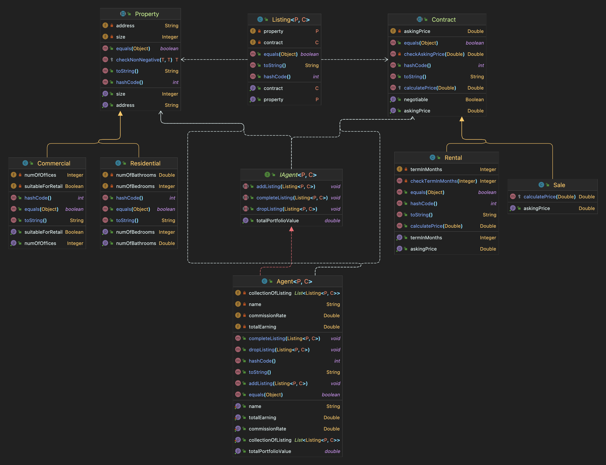
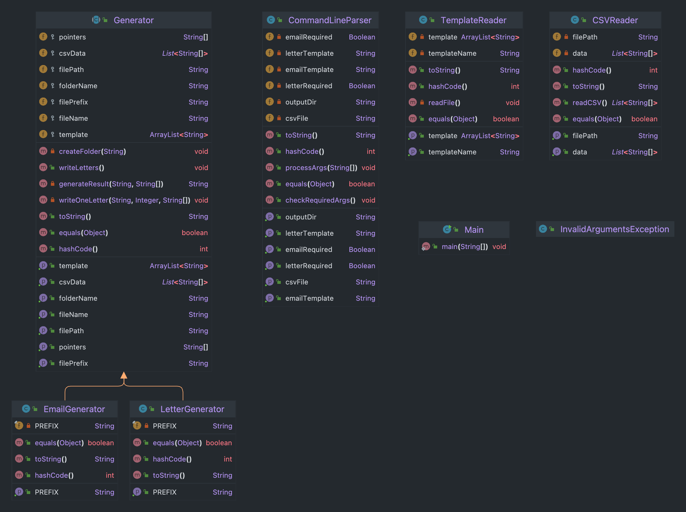
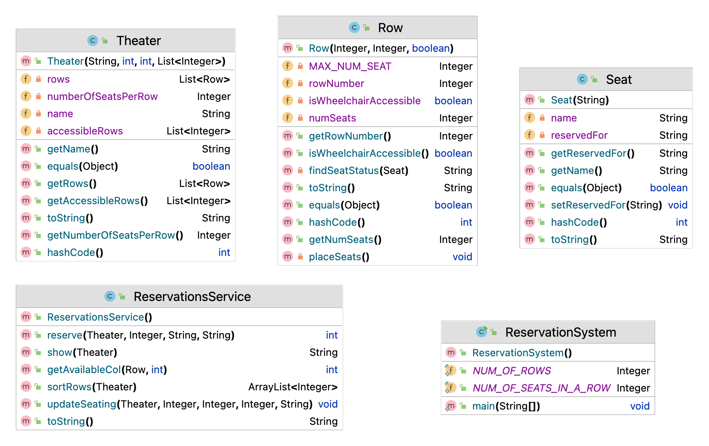

# Java_OOD_Projects

Obeject Oriented Programming Practice Projects

### Project_1 - Assign7 :

Your team has been commissioned to build part of the back end for a new property company website, similar to Redfin or Zillow. The key entities in the system are properties, contracts (sale vs. rental), listings, and real estate agents.

UML:

### Project_2 - Assign8  :

The problem: Insurance company communication automation

You are a member of an IT team for a nationwide insurance company. Unfortunately, your company recently suffered a devastating data breach. Private and sensitive data of millions of your customers may now be compromised…

The whole company is still grappling with the consequences of the breach, but the clock is already ticking – it is time to inform the customers. The members of the board of the company have decided to send an email informing every customer about the data breach. Then, the company will also send the same information using the regular mail. They are asking you to help them out, and to automate the process that the insurance company will use to communicate with its customers.

UML:

### Project_3 - Assign9  :

The problem: Theater reservation system

Implement a reservation system for movie theaters that automatically places users in the most desirable seats available for their party. 

UML:

